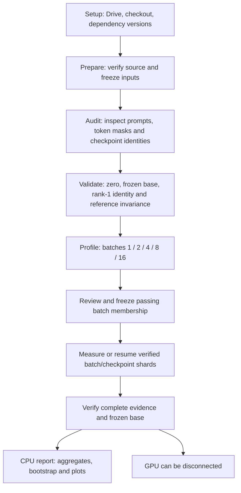
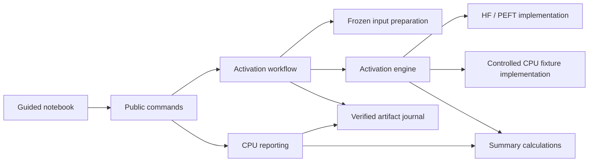
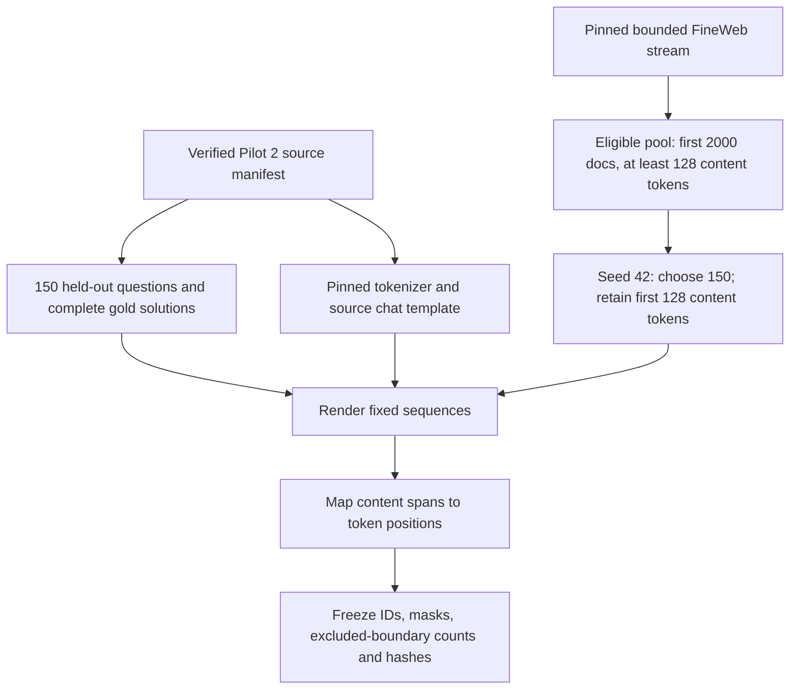

# Pilot 3 technical design

Status: proposed implementation design

Scientific requirements are fixed by [the spec](spec.md). This document explains
how to implement them. Interface and array names below are proposed names, not
already-existing code. Changes to scientific definitions require an explicit
decision; private helper organization can evolve during implementation.

## 1. How to read this document

- **Module:** a piece of software with an interface and an implementation.
  Here, a *software module* is distinct from an *adapted linear module* inside Qwen.
- **Interface:** inputs, outputs, invariants and failure behavior a caller needs
  to know. It is more than a function's argument list.
- **Seam:** where tests can substitute controlled behavior. We will substitute
  the model/data access there, while exercising the real workflow and storage.
- **Schema:** the agreed structure of saved data, including array shapes.
- **State machine:** allowed progress states and transitions.
- **Sufficient summaries:** sums and counts from which we can reconstruct the
  approved measurements, without keeping all token activations.

Read the stage diagram first, then the interfaces, the measurement loop and the
artifacts. The last sections explain failure handling and implementation slices.

## 2. The user-visible execution stages



Preparation may access pinned datasets/tokenizer files. Validation, profiling
and measurement need the model. Reporting uses saved summaries only.

The final report cannot run as if complete when validation failed or a required
shard is missing. It can explain the incomplete state without presenting a
completed scientific result.

## 3. Fit with the current repository

The existing package already exposes commands, dependency injection, frozen
inputs, run status and CPU reporting. Keep this architecture; no migration to
a new package layout or broad refactor is needed for Pilot 3.

| Existing capability | Reuse approach |
|---|---|
| CLI dispatch with lazy optional dependencies | Add Pilot 3 commands without importing GPU libraries for reporting |
| Frozen JSON and hashing helpers | Reuse behavior; extend only where verified multi-file shards need it |
| Training checkpoint verification and run locking | Reuse source-file checks; keep Pilot 3 run locking separate from source training |
| Frozen-base parameter hashing | Reuse the exact source hash semantics |
| Matched-input and paired reporting tests | Reuse their behavioral testing pattern |
| Generation backend | Do not use generation for activation measurements |
| SFT evaluation loader with historical runtime restrictions | Do not reuse its entire workflow; verify source evidence directly |

Avoid changing Pilot 1/2 behavior to accommodate Pilot 3. Source adapters and
historical configs are read-only inputs. Pilot 3 declares its own recorded runtime.

## 4. Software modules and their interfaces



The workflow is the main test seam. Tests invoke it with controlled dependencies
and inspect its durable outputs. Tiny real-model tests exercise the activation
engine interface using actual Transformers/PEFT objects.

| Software module | Proposed interface | Responsibility and invariant |
|---|---|---|
| Input preparation | prepare(source, corpus settings, root, plan name) → prepared manifest | Verify source, render/tokenize once, save IDs/masks and immutable identity |
| Activation workflow | validate / profile / measure(prepared or frozen plan, dependencies) → saved evidence | Order gates, own checkpoint/batch traversal, reject incompatible resume |
| Activation engine | inspect; capture reference; measure checkpoint; close | Own loaded model, hooks and switching; expose summaries rather than arbitrary raw model objects |
| Summary calculations | accumulate / combine / derive(summaries, weighting) → measurements | FP64 sums, explicit undefined coverage, common math for inference and reporting |
| Artifact journal | verify / commit / enumerate(identity, payload) | Persist completed shards and validate checksums; never count unmarked payloads |
| Reporting | report(frozen plan, verified summaries) → report manifest | Reconstruct all requested views/intervals/plots without model inference |

These are responsibilities, not a demand for one class per row. Prefer small
public interfaces hiding hook lifecycle and persistence complexity. Private
helpers can remain simple functions. Do not create a framework for hypothetical
model families.

### Proposed command family

Use activation-specific prepare, validate, profile, freeze, measure and report
commands under the existing CLI. All relevant commands accept an output root;
later stages consume saved manifests rather than independently retokenizing.

Separate **prepared input identity** from **frozen execution identity**: profiling
must happen before the production batch size is known. Freezing writes a new
immutable execution manifest referencing the prepared inputs and reviewed
profiling evidence. It does not mutate an already-running production config.

Each command returns a concise saved-artifact location and state. The notebook
shows friendly summaries; the same command remains usable without Colab.

## 5. Input preparation and token ownership



Question and solution content spans must be tracked separately from instruction
and chat spans. Use tokenizer-aware offsets where supported and verify against
the final rendered tokenization. A token crossing a content boundary is excluded
with a recorded reason. Do not assume a tokenized prefix length always locates
the boundary: tokenization can change at concatenation points.

FineWeb selection uses its pinned recorded stream configuration. Its choice
must be visible before preparation; no hidden floating dataset default. Source
access is substitutable for CPU tests. Freeze the final wrapped tokens after
selecting the content prefix, and report actual content counts.

The input audit displays representative and longest sequences, decoded counted
positions, excluded positions, source hashes and module/checkpoint inventory.
Required masks are disjoint; selected content positions cannot include padding.

## 6. Model passes and hook lifecycle

```mermaid
sequenceDiagram
    participant W as Workflow
    participant E as Activation engine
    participant J as Artifact journal
    W->>J: Verify existing batch/checkpoint evidence
    W->>E: Load frozen batch token IDs and masks
    W->>E: Capture untuned reference with adapters disabled
    E-->>W: Bounded reference handle + baseline summaries
    W->>J: Commit baseline summary shard if missing
    loop Each missing checkpoint: 0, 8, 16, 32, 64
        W->>E: Enable verified checkpoint; measure against reference
        E-->>W: Per-example block/module summaries + diagnostics
        W->>J: Write payloads, verify hashes, write completion marker last
    end
    W->>E: Release reference and batch buffers
```

Skip a batch entirely when all its required shards verify. For a partial batch,
recreate the temporary full untuned reference when needed; persist only its
sufficient summaries by default. Verify recreated baseline summaries against
the saved shard before using it. This avoids persisting all untuned token
activations while allowing safe resume.

Use attention masks and explicit position handling so padding does not alter
content positions. Record the actual padding/position policy and freeze it.
Disable attention caches for forward-only measurement. Where possible, run the
transformer body directly instead of creating a full vocabulary-logit tensor;
prove the hooked block outputs agree with the supported model forward path in
the tiny-model integration test before using this memory optimization.

Hook callbacks do not write files. They reduce captured tensors promptly into
per-example summaries. Only the untuned block reference needed for subtraction
survives across checkpoint passes. Local module inputs/ordinary outputs are
temporary; do not retain 196 modules' full tensors unnecessarily.

Remove hooks in guaranteed cleanup, restore adapter state after exceptions and
release GPU buffers between batches. Measurements run in eval/no-gradient FP32.
Hook inventory is verified before collecting anything; shape mismatches fail.

### Why module subtraction is different

For an adapted linear module input x from the **adapted pass**, compute ordinary
output W x plus frozen bias, and direct contribution scale × B(Ax). Compare
these with the actual pre-addition branch and adapted module output on the same
x. Do not subtract an untuned-pass module output whose x has changed upstream.

Block subtraction uses the two full passes on identical model-input tokens.
Upstream changes belong in that quantity.

## 7. Summary schemas and calculations

All schemas carry an explicit version. Array axes are named in metadata,
including layer/module order. Do not infer axes from incidental hook order.

| Saved object | Key fields |
|---|---|
| Prepared manifest | Protocol/schema version; source model/tokenizer/dataset pins; checkpoint hashes; template; cohort IDs; masks and input hashes |
| Example record | Stable ID; corpus; source index/identity; rendered text; token IDs; per-view masks/counts; excluded-token diagnostics |
| Frozen execution manifest | Prepared-manifest hash; ordered batch membership; batch size; runtime/numerical settings; thresholds; profiling review identity |
| Baseline batch payload | Per-example/per-view baseline vector sums, norm sums and token counts for each block |
| Checkpoint batch payload | Per-example/per-view delta vector sums and delta-norm sums; module contribution/output-norm sums; ratio sums and defined counts |
| Completion marker | Batch/checkpoint identity; input/config hashes; payload paths/hashes/shapes; validation evidence identity |
| Validation evidence | Gate result; source/hash inventory; sampled token/module IDs; maximum errors; thresholds; resolution coverage |
| Final result | Measurement definitions; aggregates; confidence intervals; counts/coverage; source shard identities; interpretation limits |

For batch size E, views V, blocks L=28 and hidden width H from model config,
block vector sums have axes E × V × L × H; block magnitude sums/counts have
axes E × V × L. Module sums/counts use E × V × L × M, with M=7. Metadata binds
every E row to a stable example ID; irrelevant corpus views have zero count.
NPZ contains numeric arrays only, with no pickled Python objects.

For example i and view v, retain count n, sum of changes SΔ, sum of baseline
vectors Sbase, sum of change norms D and sum of baseline norms B.

| Calculation | Token weighting | Equal-example weighting |
|---|---|---|
| Mean change vector | Sum SΔ divided by sum n | Mean of SΔ/n over nonempty examples |
| Mean baseline magnitude | Sum B divided by sum n | Mean of B/n over nonempty examples |
| Mean change magnitude | Sum D divided by sum n | Mean of D/n over nonempty examples |
| Primary block scalar | Norm of weighted mean change / weighted mean baseline magnitude | Same formula with example weighting |
| Primary module scalar | Weighted mean contribution norm / weighted mean ordinary-output norm | Same formula with example weighting |

For secondary per-token module ratios, also retain their sum and defined-token
count per example. Token weighting combines these sums/counts; equal-example
weighting averages each eligible example's defined-token mean. Save coverage
for both. Exactly-zero aggregate denominators become null, never epsilon-adjusted.

No report calculation needs all token activations. These summaries support the
approved weighting and example bootstrap, but not arbitrary token-level queries.

## 8. Validation and profiling contracts

Validation is evidence tied to identities, not a generic checkbox. It verifies
step-0 exact zeros, frozen-base/checkpoint hashes, all intended hook/module
identities, rank-1 agreement and disabled-adapter invariance across switches.

Real rank-1 checks sample up to 16 positions per module/checkpoint/view. Select
positions reproducibly and retain the full multiplication input shape before
selecting compared outputs. Scientific aggregation covers all counted tokens.
Use the spec's fixed thresholds; save both absolute errors and their allowed
thresholds. Exact zero cannot be excused by those thresholds.

The profiler uses fixed representative/longest inputs and the real reference
cache. Time after warmup with GPU synchronization; include baseline/checkpoint
forward work and report the timed scope. Compare summaries, counts and undefined
coverage with batch 1. Record OOM as an unsuitable candidate, release its buffers,
and continue; other errors are not swallowed.

The freeze step accepts only a reviewed passing candidate and saves the actual
ordered production batches. It binds validation/profile evidence to runtime and
input identities. Measurement rechecks exact-zero and other applicable gates
under the frozen production batches, because preliminary validation may have
used a different batch shape. Validation sampling/allowances remain unchanged.

## 9. Durable progress and failure recovery

```mermaid
stateDiagram-v2
    [*] --> Prepared
    Prepared --> Validated: instrument evidence passes
    Validated --> Profiled: candidate evidence saved
    Profiled --> Frozen: passing candidate reviewed
    Frozen --> Running
    Running --> Failed: OOM, nonfinite, failed gate or integrity error
    Failed --> Running: same identity and compatible runtime; verified resume
    Running --> Measured: every required shard verified and gates pass
    Measured --> Reported: CPU report reconstructed
```



A failed validation cannot be bypassed by rerunning the report. Only a new
successful validation under the same permitted identity resolves it; a protocol
change requires a new plan. Reconnection never silently changes batch membership.

Artifact layout under the canonical root:

- Plans: prepared and frozen execution manifests.
- Runs: Pilot 3 named run, with config, inputs, metadata/status, logs,
  validation/profile evidence, baseline/checkpoint shards and aggregate results.
- Reports: derived report config, source manifest, structured results and plots.

Source-relative references plus content hashes survive workspace relocation;
the old source config is preserved as evidence. The current root is an execution
parameter, not a replacement for identity verification.

Shard commit sequence: write temporary payloads → validate/read back → record
hashes → publish payloads → write completion marker last. A marker binds the
whole payload set. Drive is not assumed to provide a multi-file transaction.

Before resuming, acquire the writer lock and verify identities/marked payloads.
Unmarked fragments can be replaced on retry; marked checksum corruption stops.
Do not auto-remove a lock solely because it is old: inspect whether the owner
is active and expose a documented stale-lock recovery procedure.

The monitor may show its last valid status after a transient parse failure.
Process exit status and verified completion evidence determine success. Logs
must explain the failed stage, batch/checkpoint identity and recoverable progress.

## 10. CPU reporting and guided notebook

Reporting reads only verified summaries, derives both weightings and the
secondary diagnostics, then bootstraps examples 2,000 times with seed 42.
The same GSM8K resample is used across checkpoints and question/solution views;
FineWeb resamples independently. Recompute ratios for each draw. Report coverage
of undefined draws and do not present an interval as defined when it has no
defined replicates.

Save structured arrays/tables first, then render block curves and module
heatmaps from those values. This makes plots inspectable and reconstructible.
Label normalization, weighting, views and conditional uncertainty explicitly.

Notebook sections follow the stage diagram. Each section explains what it
does, why it is needed, expected output, saved location and safe rerun behavior.
Setup verifies checkout entry points and versions before allocating expensive
work. Source checks display resolved checkpoint files, not just plan labels.
The final CPU sections can run after reconnecting with no GPU or loaded model.

Retain the interview, spec and this design as the question/decision guide; link
them from notebook introduction cells. Prior-pilot safeguards belong beside
the relevant instructions rather than in an unrelated warning wall.

## 11. Testing and build sequence

Use four layers: independent numerical fixtures; connected workflow tests with
controlled dependencies; tiny real Qwen/PEFT CPU integration; actual GPU preflight.
The production journal/report logic must be real in workflow tests, not mocked
away. GPU success remains a runtime gate, not something CPU tests can assert.

Build vertical slices: frozen input preparation, one validated measurement
through artifacts, all-checkpoint resumable measurement, reviewed profiling,
CPU report, then guided Colab integration. Each slice includes its own tests and
user-visible result. No broad prefactoring is required by the current design.

Tickets will be proposed and reviewed before publication. Implementation has
not started. Private function names can change; scientific definitions, source
identity, saved-schema semantics and accepted tolerances cannot silently change.
