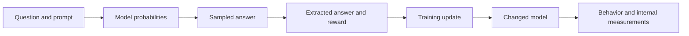
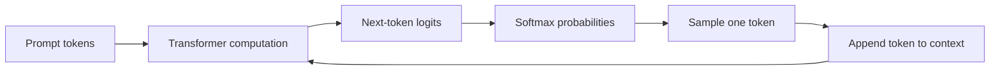
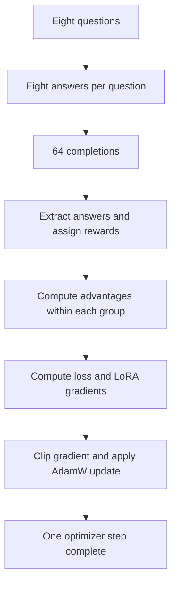
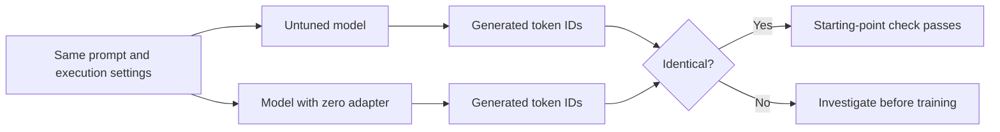
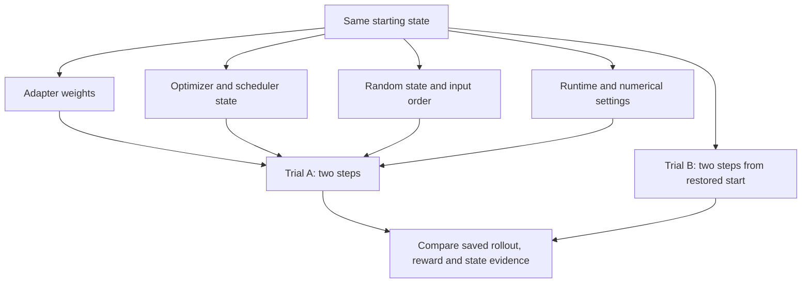
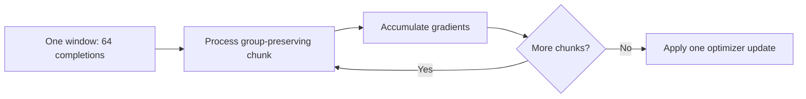
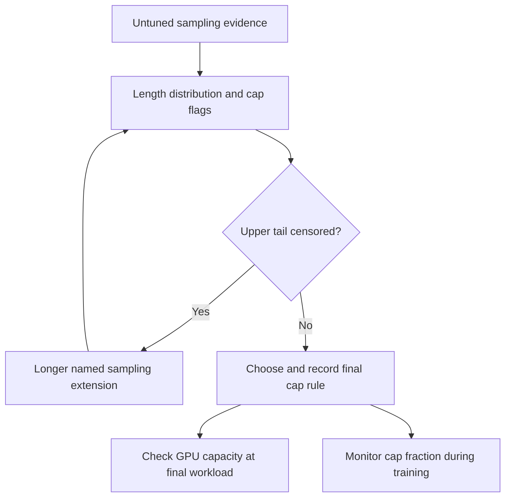
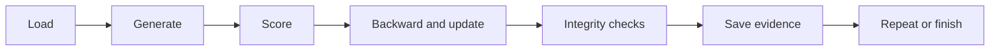
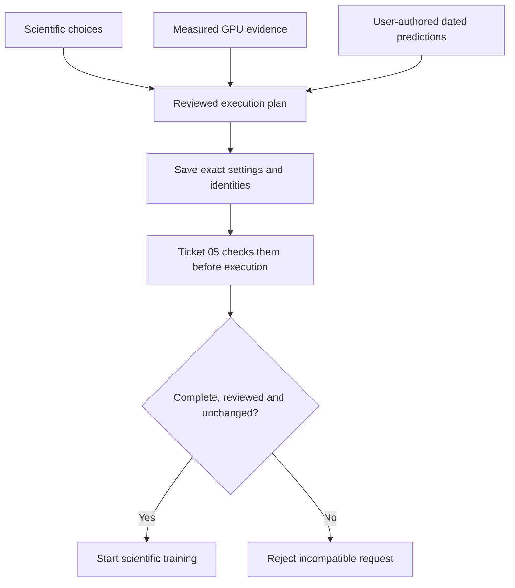

# Understanding Ticket 04 from first principles

## Start with the question we actually care about

We want to compare what SFT and GRPO do to a language model: its answers,
response lengths, and internal activations. The experiment changes the training
objective. To interpret the comparison, we need to know what else changed.

Suppose the GRPO model gives shorter answers. That could reflect learning from
reward. But it could also reflect a smaller generation limit, a different
prompt, or a scorer that rewards one answer format. The observation alone does
not separate those explanations.

**Mental model: an experiment is a chain of transformations. Every link can
change the result.** Ticket 04 checks the real execution chain and records its
choices before the main run. It does not prove that every possible bug is absent
or that the scientific prediction will hold.

## 1. What is one GRPO training step?

### First: the model produces probabilities

A language model takes the tokens it has seen and assigns a score, called a
**logit**, to each possible next token. Softmax converts these scores into
probabilities. Sampling chooses a token according to those probabilities.
The chosen token is appended to the context, and the process repeats.

This is why generating a long answer takes time: the next token depends on the
previous ones. Batching lets several answers advance together; it does not
remove the sequential dependency within each answer.

### Second: we evaluate the sampled answers

In our task, the scorer extracts a number from the generated text and compares
it with the gold answer. A correct, valid, uncapped completion receives reward
1; otherwise reward 0. The extraction decision is part of the experimental
instrument. If extraction fails on a correct answer, the training loop receives
the wrong feedback.

### Third: GRPO compares answers to the same question

For each question, we sample eight answers. GRPO asks which answers did better
than the others in that group. It converts rewards into **advantages** by
subtracting the group mean and scaling by group variability, using the frozen
standard-deviation convention and stabilizer.

For a group with four correct and four incorrect answers:

| Answers | Reward | Relative signal |
|---|---:|---|
| Four correct answers | 1 | Positive advantage |
| Four incorrect answers | 0 | Negative advantage |

The loss uses this signal so a normal optimizer update tends to increase the
probability of the positive-advantage sampled answers and decrease the
probability of the negative-advantage ones. Shared parameters mean this is a
tendency, not a guarantee for every answer after every update.

If all eight rewards are equal, there is no within-group distinction. Advantages
are zero. This is a **dead group**: it provides no policy-gradient signal under
our zero-KL setting. It does not necessarily mean the question is impossible;
all answers might instead be correct.

### Fourth: gradients tell the optimizer how to change LoRA

A **gradient** measures how a small change in each trainable parameter would
change the loss. Backpropagation computes those derivatives through the model.
AdamW uses them, together with stored history, to update the LoRA parameters.

**Mental model: a training step is a feedback loop.** Ticket 03 verified this
loop on tiny models. Ticket 04 exercises it with real Qwen and real inputs.

## 2. What does “matched starting point” mean?

Our adapted linear modules calculate a base contribution plus a LoRA
contribution:

\[
y = Wx + BAx.
\]

The base weights \(W\) stay frozen. We train the small factors \(A\) and \(B\).
Initially, PEFT makes one factor zero, so \(BAx=0\). The untrained adapter should
therefore reproduce the untuned model's computation under matching execution
settings.

**Why tokens rather than accuracy?** Accuracy compresses 150 answers into one
number. Two different sets of answers can produce the same accuracy. Comparing
generated tokens is more sensitive to an unintended starting change.

**Mental model: before measuring a treatment effect, check that treatment zero
means no intervention.** Historical 64% accuracy cannot serve this purpose:
the historical prompts, samples and execution settings are not fully known.

## 3. Why repeat two short GPU trials?

Sampling is random, and training has state. A seed is an input to a random-number
generator; its **state** records where that generator is in its sequence of
draws. Two executions with the same seed can diverge if one consumes additional
random draws or uses a different computation path.

AdamW also has state: its moving estimates of past gradients affect the next
update. The next training result depends on more than the current adapter.

The trials test whether our declared execution procedure repeats, and whether
losses and gradients remain finite. A NaN or infinity is invalid numerical
state; continuing would not produce a trustworthy parameter update.

The trials are disposable. Starting the main run from their updated adapter
would secretly give it extra training. Starting from their advanced random
state could change its sampled answers. We keep their state separate.

**Mental model: reproducibility is restoring a machine's complete starting
state, not merely remembering its seed.** These checks do not establish
agreement across different GPU types or batch shapes, or across training seeds.

## 4. Why are there two meanings of batch size?

The **algorithmic batch** defines one update: eight questions times eight
completions, giving 64 completions. The **memory chunk** defines how much work
we place on the GPU at once.

The GPU must hold model weights, intermediate activations, sampled contexts,
gradients and other working memory. Frozen base weights do not eliminate
backpropagation through the base computation: gradients still need to reach
LoRA parameters inside it. Longer sequences can increase the working memory
substantially.

**Mental model: carry a large load in several trips without changing the load.**
Chunking should change memory use, not the intended mathematical update.

There is a subtle failure mode: averaging each chunk separately can change
example weighting. For illustration, suppose one chunk contains 100 supervised
tokens and another contains 10. Averaging their two mean losses equally gives
the smaller chunk's tokens ten times as much influence per token. The intended
whole-window token average instead divides the total loss by 110 tokens.

That is why loss normalization and accumulation must be checked together.
Our pinned DAPO implementation uses the whole generation-window completion
token count; a similarly named alternative need not have the same denominator.

## 5. Why choose a completion cap from evidence?

Generation needs a maximum length to bound memory and time. A **cap** stops an
answer after a fixed number of new tokens if the model has not ended it.

But a cap is also an intervention on behavior. A truncated answer may be
unfinished. Our approved reward rule gives it zero, even if an answer number
appeared earlier. This can create pressure toward shorter answers.

The 99th percentile is the length at which approximately 99% of observed
answers are no longer than that value. If those observations were cut off,
we do not know their true lengths. An apparently modest percentile can then
be a measurement limit rather than a property of the model.

**Mental model: a ruler that ends at 30 cm cannot tell you how tall an object
larger than 30 cm is.** A cap above the measured uncensored tail reduces initial
truncation; it does not guarantee that later trained outputs stay below it.

## 6. Why profile the entire procedure?

“The GPU forward pass is fast” is not enough to estimate total experiment time.
The process also loads models, samples tokens sequentially, calculates rewards,
backpropagates, transfers data, hashes weights and saves artifacts.

We measure generation and training costs separately, plus overhead. Throughput
depends on lengths and hardware, so estimates from a different workload or
precision are not guarantees for this one.

Saved checkpoints also determine recovery cost. Resuming at steps 0, 8, 16,
32 or 64 means work after the last sealed checkpoint may need to be repeated.
The largest gap is 32 steps. Ticket 04 makes this possible redo cost visible.

**Mental model: estimate the whole journey, including transfers and stops.**
Memory fit is a separate question from speed; a fast configuration that runs
out of memory on the final workload is unusable.

## 7. Why review, preregister and freeze?

These are different activities:

| Activity | Purpose | Example |
|---|---|---|
| Review | Understand and judge the measured setup | Does the selected chunk fit the final-length workload? |
| Preregister | State scientific predictions and interpretation before results | Which accuracy-drop margin will define the non-inferiority test? |
| Freeze | Bind execution to an exact reviewed recipe | Save scorer, cap, group order, precision and source hashes |

The non-inferiority margin is the largest accuracy drop we are willing to
accept for that claim. It is a scientific interpretation choice, not something
memory profiling can determine. Its proposed value is not automatically an
approved value. Failing the eventual test may be inconclusive; it is not by
itself proof of damage.

Monitors are also policies, not just numbers. A high cap fraction might flag
possible censoring; a high dead-group fraction means little reward contrast.
The frozen plan must say whether each condition records a warning, pauses for
inspection, or stops the run. Nonfinite loss or gradients stop execution.

A hash is a fingerprint of file contents. It helps detect a changed source or
config; it does not prove that those contents are scientifically correct.
Freezing is implemented by saving the plan and having execution verify it.
It is not a claim that files have become physically impossible to edit.

**Mental model: decide the recipe and interpretation before seeing the dish.**
Changing a scientifically meaningful choice creates a recorded new variant,
so comparisons retain their meaning.

## What Ticket 04 can and cannot establish

It can establish that the current setup passes declared starting-point,
repeatability, integrity and capacity checks, and that its settings are explicit.
It cannot establish that GRPO will preserve GSM8K accuracy, reproduce the earlier
SPAR result, or explain a causal mechanism. Those require the later training,
evaluation and internal-measurement stages.

**Its deliverable is a reviewed run recipe plus real-GPU evidence. The scientific
adapter is produced in Ticket 05.**

Related: [Ticket 04](../.scratch/pilot4-grpo/issues/04-preflight-and-prereg-freeze.md),
[Pilot 4 guide](pilot4-grpo.md), and [control revisions](adr/0010-pilot4-tiny-learning-control.md).
